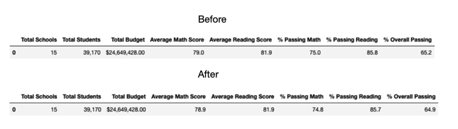
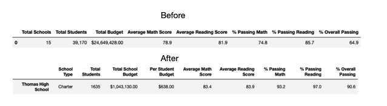
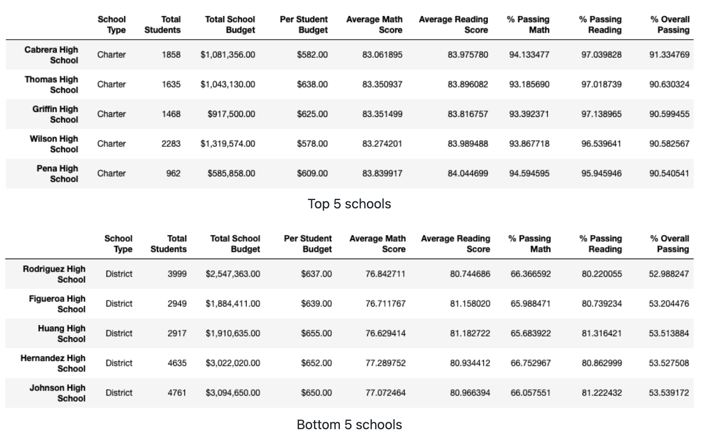
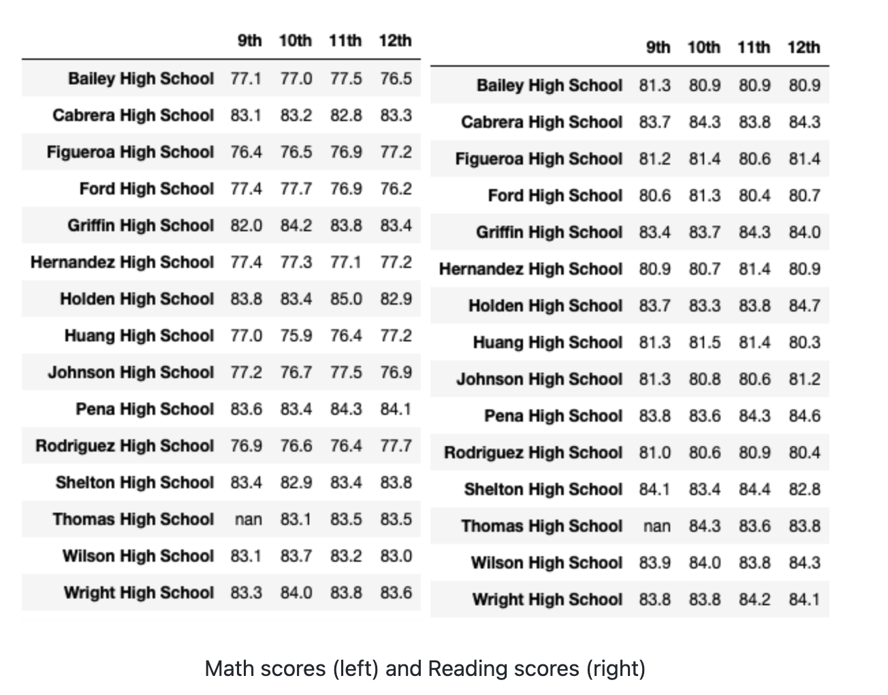
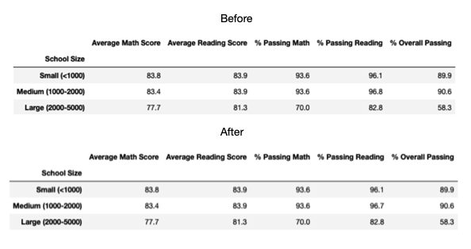
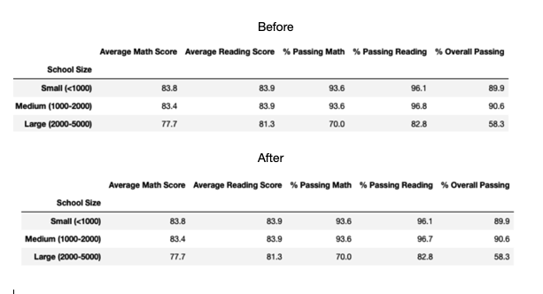
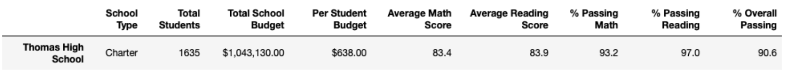

# School_District_Analysis
## 1.Overview of the school district analysis
The purpose of our analysis is to find the overall passing percentages of the students and see if there is any correlation with the budget per student. What we have found is that some of the test scores from the 9th grade at Thomas High School are missing. Since these values are missing we want to take all of the scores from the high school so that it doesn't affect our overall numbers.

## 2. Results:

### 2.1 District Summary

  

The district summary was barely affected by the correction made:
* The average Math Score decreased by 0.1 point to 78.9.
* The % Passing Math decreased by 0.2% to 74.8%.
* The % Overall Passing decreased by 0.3% to 64.9%.

### 2.2  School Summary

  

The school summary was slightly affected by the correction made:
* The average Reading Score increased by 0.1 point to 83.9.
* The % Passing Math decreased by 0.1% to 93.2%.
* The % Passing Math decreased by 0.3% to 97.0%.
* The % Overall Passing decreased by 0.3% to 90.6%.

### 2.3 High and Low performing schools based on the overall passing rate

 * The 5 highest and 5 lowest performing schools ranking in the district was not affected by the correction.

  

### 2.4 Math and Reading Scores by Grade

  

* As expected, the average math and reading scores for Thomas High School ninth graders show as NaN on the math and reading scores by grade summary

### 2.5 Scores by School Spending

  

* The only changes are on the $630-644 range where the % Passing Reading and the % Overall Passing both dropped by 0.1% to respectively 84.3% and 62.8%.

### 2.6 Scores by School Size

  

* The only change is on the Medium size school range where the % Passing Reading dropped by 0.1% to 96.7%.

### 2.7 Scores by School Type

  

* There is no noticeable change to the scores by school type summary after correction.

## 3.Summary
After we have replaced the scores of the 9th grade students we learn that not much has changed. We have nullified the values that we felt would alter size,district, spending and overall passing percentage of the students.
